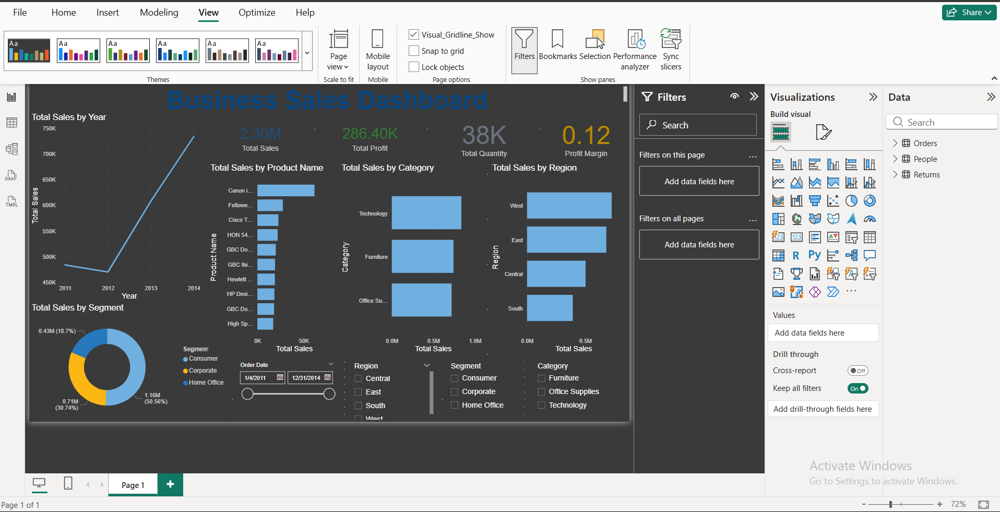

# FUTURE_DS_01 – Business Sales Dashboard (Power BI)

## Project Overview
This project presents a business sales dashboard built using Power BI to analyze e-commerce sales data and generate actionable insights for decision-making.

---

## Business Objectives
- Track key sales and revenue metrics
- Identify top-performing products and categories
- Analyze sales trends over time
- Support strategic business decisions

---

## Tools & Technologies
- Power BI Desktop
- Power Query (Data Cleaning)
- DAX (Calculated Measures)
- Excel / CSV (Data Source)

---

## Dashboard Preview

---

## Key Insights
- A small number of products contribute the majority of revenue
- Sales show clear seasonal trends
- Certain regions consistently outperform others

---

## Business Recommendations
- Prioritize marketing for high-performing categories
- Align inventory planning with peak sales periods
- Explore growth opportunities in underperforming regions

---

## Repository Structure
- `powerbi/` – Power BI dashboard file (.pbix)
- `visuals/` – Dashboard screenshots
- `reports/` – Business insights report (PDF)
- `data/` – Sample or anonymized dataset

---

## Author
Stephen Otieno
